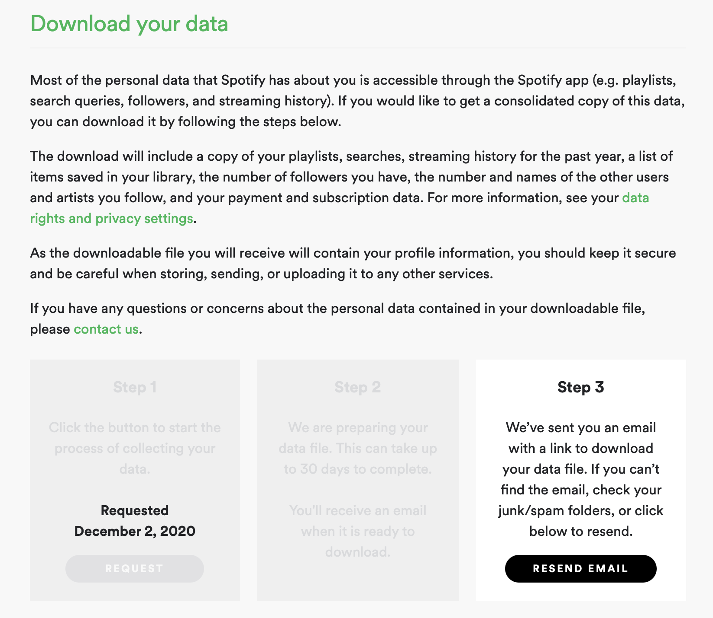

```{r setup, include=FALSE}
knitr::opts_chunk$set(echo = FALSE)
```

## Introduction

Spotify allows users to request the information that Spotify has collected of them.
Out of curiosity, I have downloaded my data and have begun analyzing it.
This is still a work in progress, but everything I have done is available on this website.

## Some details

### Accessing your data

Spotify allows users to request the information that Spotify has collected of them.
It is available by accessing Spotify's web application on a Browser and navigating to "Profile"/"Acount"/"Privacy settings" and scrolling to the bottom.



### Building a website with R Markdown and Distill

All of the data processing and analysis presented here was conducted in R using the [R Markdown](https://bookdown.org/yihui/rmarkdown/) format/system/way-of-life and then turned into a website using the  ['Distill'](https://rstudio.github.io/distill/) package.
